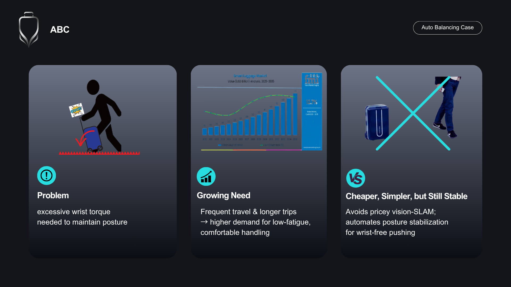
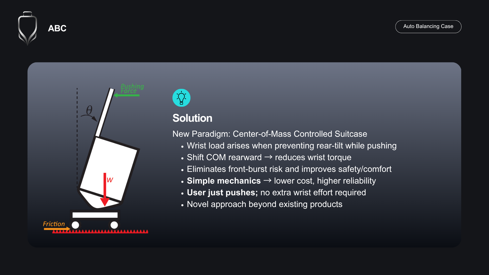
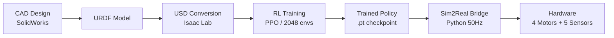
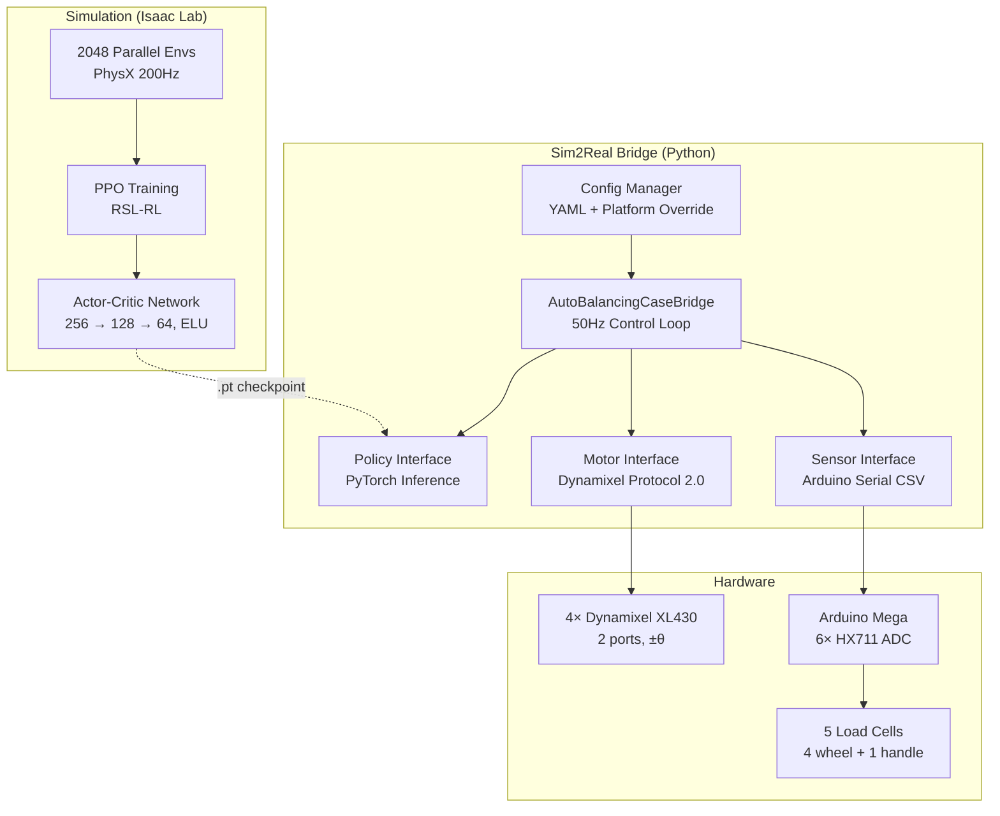
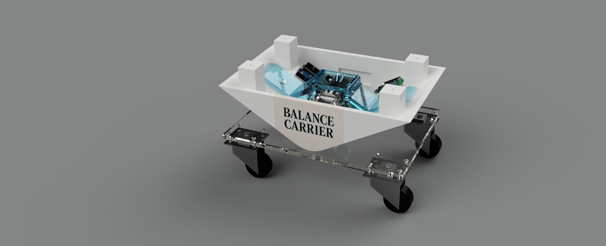
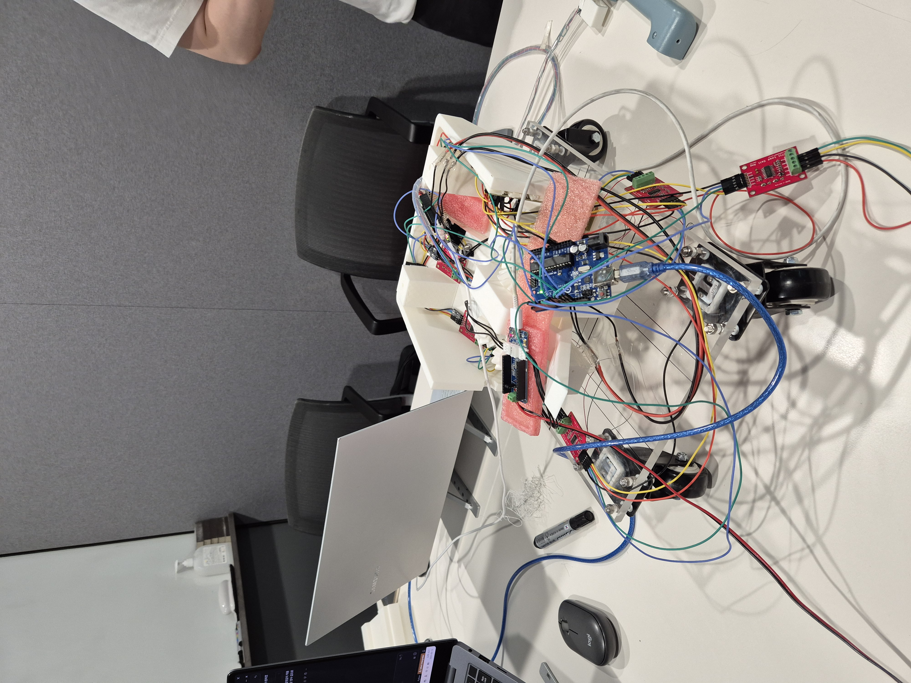
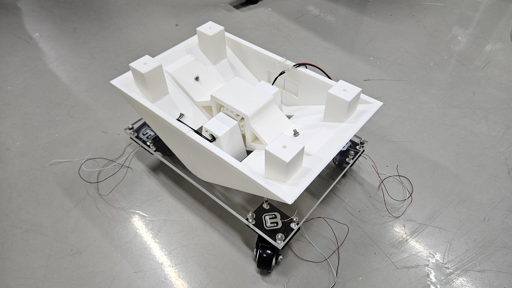

# Auto Balancing Case

***A self-balancing wheeled suitcase powered by sim-to-real reinforcement learning***


<p align="center">
  
</p>

## Motivation

Conventional wheeled suitcases tilt forward on carpets, ramps, and uneven terrain, forcing users to apply excessive **wrist torque** to keep them upright. This increases fatigue during prolonged travel and makes handling uncomfortable — yet most existing solutions rely on complex vision-based systems or powered wheels that add weight and cost.

This project takes a different approach: instead of fighting gravity with brute force, we **shift the suitcase's center of mass** in real time using a learned policy, eliminating the need for additional user effort entirely.

<p align="center">
  
  
  
</p>

## Highlights

- **End-to-end pipeline**: CAD design → URDF → Isaac Lab simulation → PPO training → real hardware deployment
- **Sim-to-real transfer** with domain randomization (external forces, velocity pushes, mass variation)
- **Real-time 50 Hz control** with 4 Dynamixel XL430 motors and 5 HX711 load cells
- **Custom reward engineering** with 9 reward terms for contact force balancing
- **2,048 parallel environments**, [256, 128, 64] actor-critic network trained over 15K iterations
- **Multi-sensor fusion**: wheel contact forces + handle force + joint state + action history → 32-dim observation

## Table of Contents

- [Motivation](#motivation)
- [System Overview](#system-overview)
- [Architecture](#architecture)
- [Technical Deep Dive](#technical-deep-dive)
- [Results](#results)
- [Future Work](#future-work)
- [Getting Started](#getting-started)
- [Usage](#usage)
- [Project Structure](#project-structure)
- [Key Specifications](#key-specifications)
- [Contributors](#contributors)
- [Acknowledgments](#acknowledgments)
- [License](#license)

## System Overview

### Core Idea — Mass-Shifting Upper Body

Rather than adding powered wheels or complex stabilization mechanisms, the suitcase features a **mass-shifting upper body** connected to the wheeled base via a single revolute (hinge) joint. When the suitcase begins to tilt — due to a ramp, carpet, or user push — a learned RL policy commands the upper body to shift its center of gravity rearward, **preventing the initial tip and eliminating the wrist torque** the user would otherwise need to apply.

### End-to-End Pipeline

The Auto Balancing Case learns to keep the suitcase upright against external disturbances using this single actuated hinge joint. A PPO policy is trained in NVIDIA Isaac Lab simulation across 2,048 parallel environments, then deployed directly on real hardware via a Python bridge running at 50 Hz — no fine-tuning on real hardware required.



## Architecture

### System Architecture

<p align="center">
  
</p>

<details>
<summary>Text version (Mermaid)</summary>


</details>

### Observation Space

Each timestep produces an 8-dimensional observation. With 4-step history, the policy sees a **32-dimensional input**.

| Index | Component | Dims | Source | Description |
|-------|-----------|------|--------|-------------|
| 0 | `joint_pos` | 1 | Motor encoder | Relative joint position (rad) |
| 1 | `joint_vel` | 1 | Motor encoder | Joint velocity (rad/s) |
| 2 | `prev_action` | 1 | Policy output | Previous action [−0.5, 0.5] |
| 3–6 | `wheel_forces` | 4 | HX711 load cells | Per-wheel contact force (N) [FR, RR, FL, RL] |
| 7 | `handle_force` | 1 | HX711 load cell | External handle force (N) |

### Reward Engineering

9 reward terms shape the balancing behavior:

| Reward Term | Weight | Type | Purpose |
|------------|--------|------|---------|
| `is_alive` | +1.0 | Bonus | Survival incentive |
| `is_terminated` | −100.0 | Penalty | Large termination punishment |
| `flat_orientation_l2` | −10.0 | Penalty | Keep platform horizontal |
| `ang_vel_xy_l2` | −0.5 | Penalty | Minimize angular oscillation |
| `hinge_pos_deviation` | −5.0 | Penalty | Stay near default joint position |
| `desired_contacts` | −10.0 | Penalty | Maintain all 4 wheel contacts |
| `wheel_contact_balance` | +3.0 | Reward | Equal force distribution (exp(−variance/mean)) |
| `wheel_contact_min_max` | −0.1 | Penalty | Reduce max–min force difference |
| `action_rate_l2` | −0.01 | Penalty | Smooth actions |

## Technical Deep Dive

### Sim-to-Real Transfer

<p align="center">
  
  <br/>
  <em>PPO training in NVIDIA Isaac Lab with 2,048 parallel environments</em>
</p>

The policy transfers from simulation to real hardware without fine-tuning. Key strategies:

- **Domain randomization**: 4 disturbance groups applied to partitioned environment subsets
  - Velocity-based pushes (x-axis, randomized range)
  - External wrenches with position offsets
  - Directional force/torque application
  - Combined push + wrench events
- **Raw observations**: No normalization applied — same value ranges in sim and real hardware
- **Observation noise injection**: Additive uniform noise on joint position (±0.005), velocity (±0.05), and forces (±0.01)

### Real-Time Control Pipeline

<p align="center">
  
</p>

The 50 Hz control loop in `AutoBalancingCaseBridge` executes 7 steps per cycle (20 ms budget):

1. **Read motor state** — Position and velocity via Dynamixel Protocol 2.0 (2 serial ports)
2. **Read sensor state** — 5 load cell forces via Arduino serial CSV
3. **Construct observation** — 8-dim vector with relative joint position (Isaac Lab compatible)
4. **Update history** — Append to 4-step deque (oldest entries dropped)
5. **Run policy inference** — PyTorch forward pass on 32-dim input (CPU, ~1 ms)
6. **Clip and send command** — Action clipped to [−0.5, 0.5] rad → 4 motors (+θ, +θ, −θ, −θ)
7. **Maintain timing** — Sleep for remainder of 20 ms cycle; warn if >10 ms overrun

**Safety systems**: Emergency stop at 0.51 rad tilt, watchdog timeout at 1.0 s.

### Hardware Design

<p align="center">
  
</p>

<p align="center">
  
  
</p>

<p align="center">
  
</p>

- **Base platform**: 4-wheel mobile base (~0.98 kg, 36 cm × 23 cm)
- **Luggage body**: ~5.6 kg connected via single revolute joint (Y-axis, ±30°)
- **Motors**: 4× Dynamixel XL430-W250 (Protocol 2.0, 57600 baud, center=2048)
- **Sensors**: 5× HX711 load cells (4 wheel + 1 handle), Arduino at 115200 baud / 10 Hz
- **Custom parts**: 3D-printed differential bevel gears, motor support, gearbox wing

## Results

<p align="center">
  
  <br/>
  <em>Real-time balancing on uneven terrain — zero additional wrist torque required</em>
</p>

- **Zero additional wrist torque** — users reported no need for extra effort to keep the suitcase upright on rough terrain
- **Responsive disturbance recovery** — the policy reacts to pushes and slope changes within one control cycle (20 ms)
- **Direct sim-to-real transfer** — the trained policy deployed on real hardware without any fine-tuning or adaptation
- **Modular integration** — the mass-shifting mechanism can be integrated into existing suitcase frames without structural redesign


## Future Work

- Quantitative handling-effort measurement (e.g., wrist torque sensor comparison with/without balancing)
- Extension to wheeled carts and logistics platforms
- On-device inference optimization (microcontroller deployment, removing laptop dependency)

## Getting Started

### Prerequisites

- Python 3.8+
- NVIDIA GPU with CUDA (for Isaac Lab training only)
- Dynamixel XL430 motors + Arduino Mega (for hardware deployment)

### Installation

```bash
# Clone the repository
git clone https://github.com/erickun0125/Auto_Balancing_Case.git
cd Auto_Balancing_Case

# Install sim2real bridge dependencies
cd suitcase_sim2real
pip install -r requirements.txt

# Isaac Lab setup (for training only)
# Follow NVIDIA Isaac Lab installation guide, then register custom environments
```

## Usage

### Training (Simulation)

```bash
cd suitcase_learning
./isaaclab.sh -p scripts/train.py --task Isaac-Suitecase-Flat-v0 --num_envs 2048
```

### Evaluation (Simulation)

```bash
./isaaclab.sh -p scripts/play.py --task Isaac-Suitecase-Flat-Play-v0 \
  --checkpoint trained_models/model_49999.pt
```

### Hardware Deployment

```bash
cd suitcase_sim2real/src

# Step 1: Calibrate load cells (first time only)
python run_policy.py --mode calibrate

# Step 2: Run single episode (4000 steps = 8 seconds)
python run_policy.py --mode episode

# Step 3: Run continuously until Ctrl+C
python run_policy.py --mode continuous

# Custom config
python run_policy.py --config path/to/config.yml --mode episode
```

## Project Structure

```
Auto_Balancing_Case/
├── suitcase_learning/               # Isaac Lab simulation & RL training
│   ├── envs/                        #   Custom environment & MDP definitions
│   │   ├── suitecase_env_cfg.py     #     Environment config, rewards, observations
│   │   └── mdp_for_ABC.py           #     Custom MDP functions (forces, events)
│   ├── agents/                      #   PPO hyperparameters
│   │   └── rsl_rl_ppo_cfg.py
│   ├── scripts/                     #   Training & evaluation scripts
│   ├── assets/                      #   USD robot model for Isaac Lab
│   └── trained_models/              #   Checkpoints & exported policies
│
├── suitcase_sim2real/               # Real hardware deployment
│   ├── src/                         #   Main bridge code
│   │   ├── run_policy.py            #     CLI entry point (calibrate/episode/continuous)
│   │   ├── bridge.py                #     50Hz control loop orchestrator
│   │   ├── policy_interface.py      #     RSL-RL model loading & inference
│   │   ├── motor_interface.py       #     4-motor control (2 serial ports)
│   │   ├── sensor_interface.py      #     5 load cell sensor interface
│   │   ├── config_manager.py        #     YAML config with platform overrides
│   │   └── config/interface_config.yml    # All hardware/policy settings
│   ├── firmware/                    #   Arduino firmware (HX711 ADC readout)
│   └── requirements.txt
│
├── suitcase_model/                  # CAD models & URDF robot descriptions
│   ├── urdf/                        #   Robot URDF definitions
│   ├── stl/                         #   3D-printable mechanical parts
│   └── ros_package/                 #   ROS-compatible URDF package
│
├── docs/media/                      # Demo videos, screenshots, diagrams
├── LICENSE
└── README.md
```

## Key Specifications

### Training Configuration

| Parameter | Value |
|-----------|-------|
| Algorithm | PPO (Proximal Policy Optimization) |
| Framework | RSL-RL on NVIDIA Isaac Lab |
| Parallel Environments | 2,048 |
| Physics Frequency | 200 Hz (dt = 0.005 s) |
| Control Frequency | 50 Hz (decimation = 4) |
| Episode Length | 8.0 s (4,000 steps) |
| Network Architecture | Actor & Critic: [256, 128, 64], ELU |
| Observation Dim | 32 (8 per timestep × 4 history) |
| Action Dim | 1 (joint position target, rad) |
| Learning Rate | 1e-3 |
| Max Iterations | 15,000 |
| Discount Factor (γ) | 0.99 |
| GAE Lambda (λ) | 0.95 |

### Hardware Specifications

| Component | Detail |
|-----------|--------|
| Motors | 4× Dynamixel XL430-W250 |
| Motor Protocol | Protocol 2.0, 57600 baud, 2 serial ports |
| Load Cells | 5× HX711 (4 wheel + 1 handle) |
| Sensor MCU | Arduino Mega, 115200 baud, 10 Hz |
| Control Loop | 50 Hz (20 ms cycle) |
| Joint Range | ±0.5 rad (±28.6°) |
| Emergency Stop | 0.51 rad tilt threshold |
| System Mass | ~6.5 kg |

## Contributors

| Name | Contributions |
|------|--------------|
| **@erickun0125** | IsaacLab Environment Setting, Sim2Real Bridge, RL Agent Training |
| **@toddjrdl** | CAD Model Design, Hardware Integration, Policy Deployment |
| **@juninjae** | Actuator & Sensor System Design, System Integration, Real World Deployment |

## Acknowledgments

- [NVIDIA Isaac Lab](https://isaac-sim.github.io/IsaacLab/) — GPU-accelerated physics simulation & RL framework
- [RSL-RL](https://github.com/leggedrobotics/rsl_rl) — PPO implementation from Robotic Systems Lab (ETH Zurich)
- [Robotis Dynamixel](https://www.robotis.us/) — XL430 motor hardware and SDK
- [PyTorch](https://pytorch.org/) — Neural network framework
- [HX711_ADC](https://github.com/olkal/HX711_ADC) — Arduino load cell library

## License

This project is licensed under the MIT License — see the [LICENSE](LICENSE) file for details.

---

*Built at Seoul National University. Demonstrates a complete robotics development pipeline from concept to real-world deployment.*
